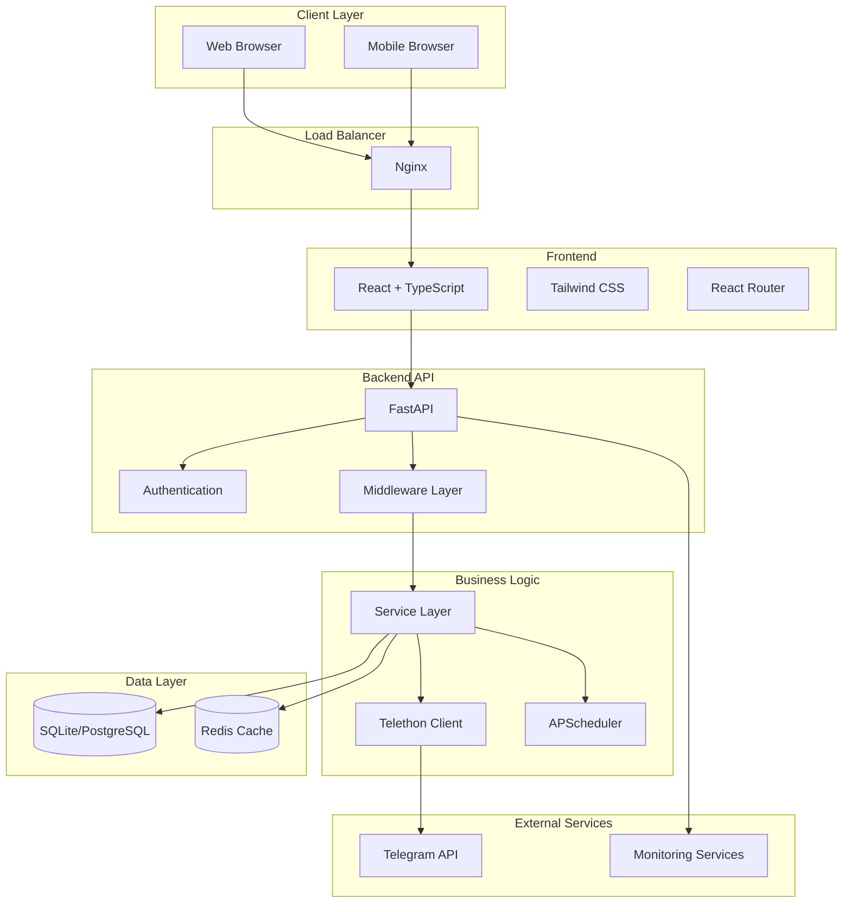
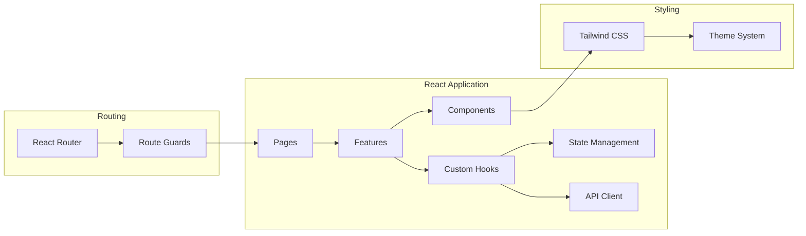
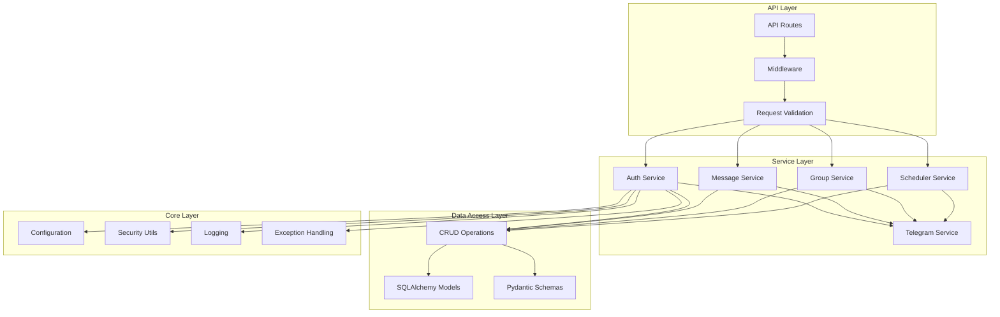
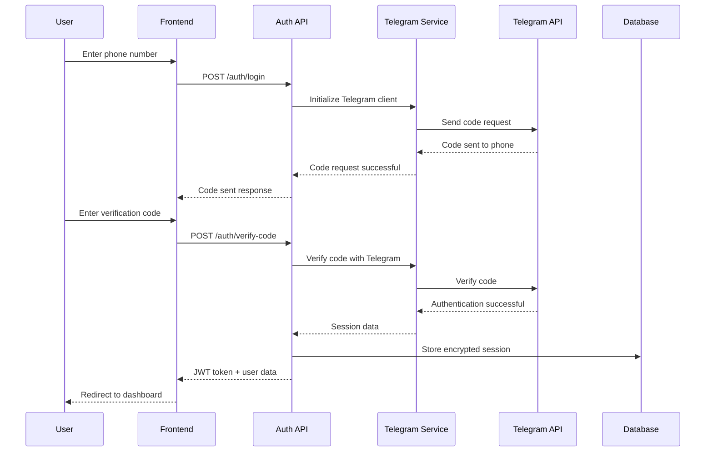
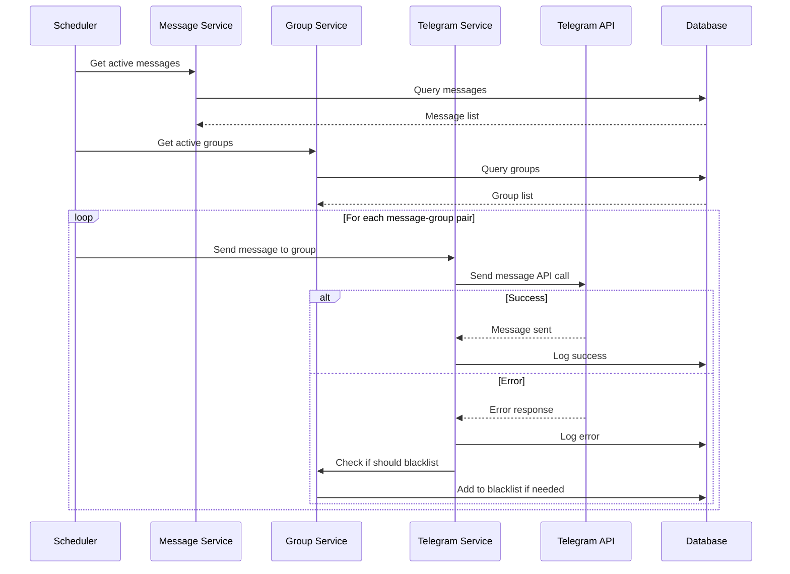
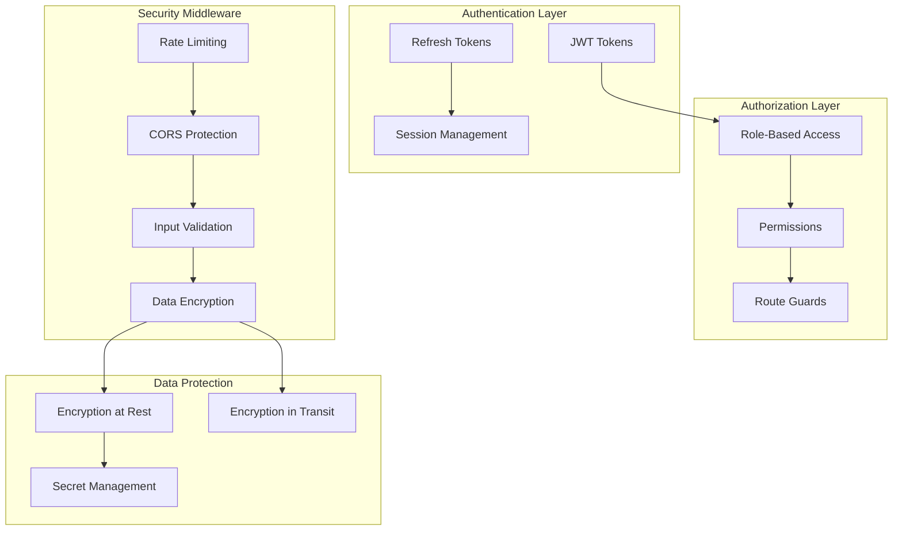
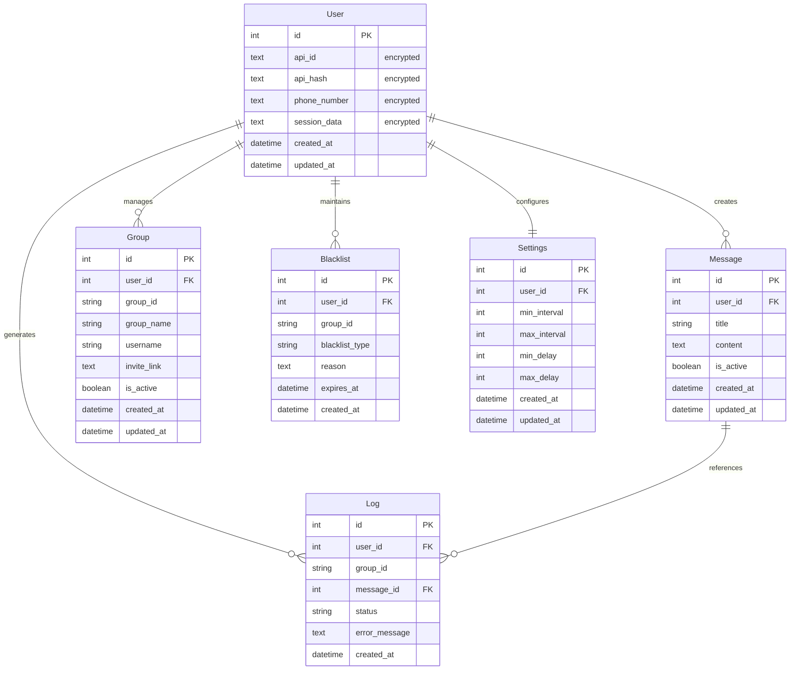
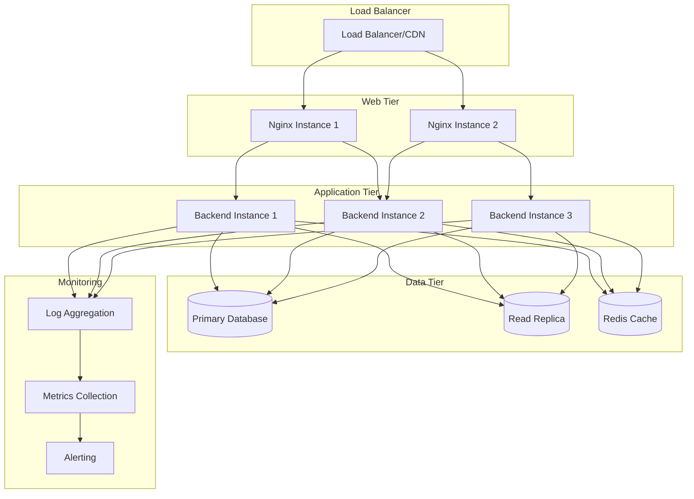
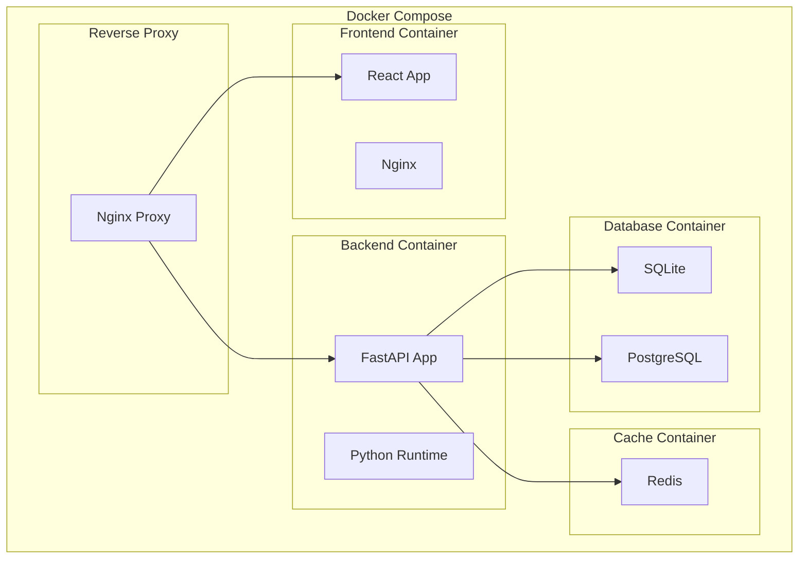
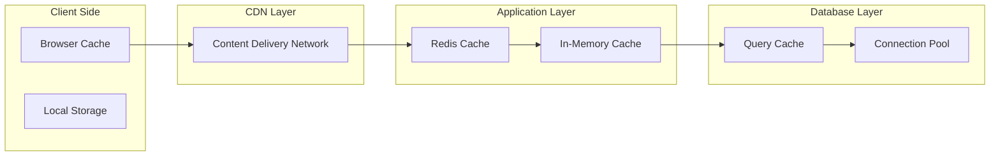

# System Architecture

## Overview

Telegram Automation adalah aplikasi fullstack production-ready yang dibangun dengan arsitektur modern dan scalable. Aplikasi ini menggunakan clean architecture principles dengan separation of concerns yang jelas antara presentation layer, business logic, dan data access layer.

## High-Level Architecture

## Component Architecture

### Frontend Architecture

### Backend Architecture

## Data Flow

### Authentication Flow

### Message Sending Flow

## Security Architecture

### Authentication & Authorization

## Database Schema

### Entity Relationship Diagram

## Deployment Architecture

### Production Deployment

### Container Architecture

## Performance Considerations

### Caching Strategy

### Scaling Strategy

1. **Horizontal Scaling**: Multiple backend instances behind load balancer
2. **Database Scaling**: Read replicas for read-heavy operations
3. **Caching**: Redis for session storage and frequently accessed data
4. **CDN**: Static asset delivery through CDN
5. **Queue System**: Background job processing for heavy operations

## Technology Stack

### Backend
- **Framework**: FastAPI (Python 3.11+)
- **Telegram Client**: Telethon
- **Database**: SQLite (development) / PostgreSQL (production)
- **ORM**: SQLAlchemy
- **Validation**: Pydantic
- **Authentication**: JWT
- **Scheduling**: APScheduler
- **Testing**: Pytest
- **Code Quality**: Black, isort, mypy, Bandit

### Frontend
- **Framework**: React 18+ with TypeScript
- **Styling**: Tailwind CSS
- **Routing**: React Router
- **State Management**: React Query + Context API
- **UI Components**: Radix UI + Custom Components
- **Build Tool**: Vite
- **Testing**: Jest + React Testing Library
- **Code Quality**: ESLint + Prettier

### Infrastructure
- **Containerization**: Docker + Docker Compose
- **Reverse Proxy**: Nginx
- **CI/CD**: GitHub Actions
- **Monitoring**: Built-in health checks + logging
- **Security**: HTTPS, CORS, Rate limiting, Input validation

## Best Practices

### Code Organization
- **Clean Architecture**: Separation of concerns with clear layer boundaries
- **Feature-based Structure**: Frontend organized by features, not file types
- **Dependency Injection**: Loose coupling between components
- **Error Handling**: Comprehensive error handling at all layers

### Security
- **Data Encryption**: Sensitive data encrypted at rest and in transit
- **Input Validation**: All inputs validated and sanitized
- **Rate Limiting**: API rate limiting to prevent abuse
- **Secret Management**: No secrets in code, environment variables only

### Performance
- **Lazy Loading**: Components and routes loaded on demand
- **Caching**: Multi-layer caching strategy
- **Database Optimization**: Proper indexing and query optimization
- **Asset Optimization**: Minification and compression

### Monitoring
- **Health Checks**: Comprehensive health check endpoints
- **Logging**: Structured logging with appropriate log levels
- **Metrics**: Performance and business metrics collection
- **Alerting**: Automated alerting for critical issues

