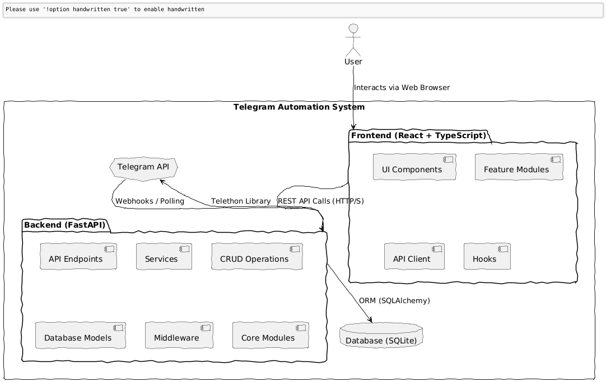

# System Architecture

This document outlines the high-level architecture of the Telegram Automation system.

## Overview

The system is composed of a FastAPI backend, a React frontend, and interacts with the Telegram API. It follows a modular and layered approach to ensure scalability, maintainability, and security.

## Architecture Diagram

Below is a diagram illustrating the main components and their interactions:

## Component Breakdown

### Frontend (React + TypeScript)
-   **UI Components**: Reusable and type-safe React components built with Tailwind CSS and Radix UI.
-   **Feature Modules**: Code organized by business features, encapsulating related UI, logic, and API interactions.
-   **API Client**: Handles communication with the FastAPI backend, including request/response handling, authentication, and error management.
-   **Hooks**: Custom React hooks for managing state, form validation, and other reusable logic.

### Backend (FastAPI)
-   **API Endpoints**: Defines the RESTful API for the frontend and other potential consumers.
-   **Services**: Contains the core business logic, orchestrating interactions between CRUD operations and external APIs.
-   **CRUD Operations**: Manages database interactions, providing an abstraction layer over SQLAlchemy.
-   **Database Models**: Defines the data structures and relationships within the SQLite database.
-   **Middleware**: Custom middleware for cross-cutting concerns like authentication, rate limiting, CORS, and error handling.
-   **Core Modules**: Shared utilities and foundational components such as security, logging, and custom exception handling.

### Database (SQLite)
-   A lightweight, file-based database used for storing application data, including user information, message configurations, and group details.

### Telegram API
-   The official Telegram API, accessed by the backend using the Telethon library, for sending messages, managing groups, and other automation tasks.

## Data Flow

1.  **User Interaction**: Users interact with the system through the React frontend via a web browser.
2.  **Frontend to Backend**: The frontend sends REST API requests to the FastAPI backend for data retrieval and operations.
3.  **Backend to Database**: The backend interacts with the SQLite database using SQLAlchemy ORM for data persistence.
4.  **Backend to Telegram API**: The backend uses the Telethon library to communicate with the Telegram API for automation tasks.
5.  **Telegram API to Backend**: The Telegram API can send updates or responses back to the backend (e.g., via webhooks or polling, depending on configuration).

This architecture provides a clear separation of concerns, making the system robust, scalable, and easy to maintain.

